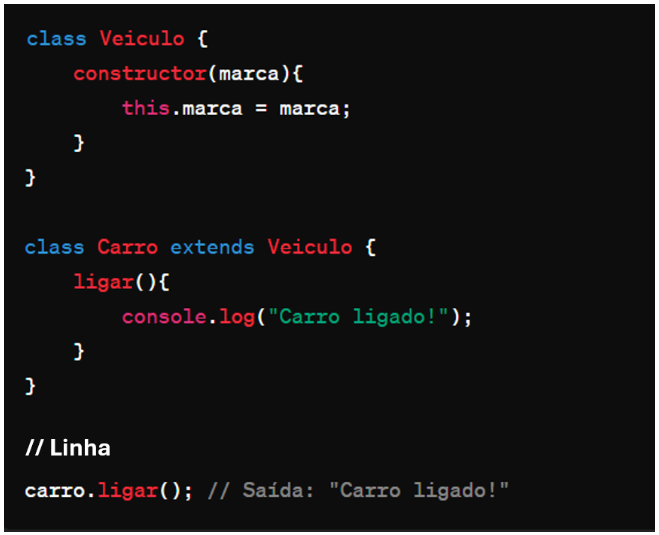

# Instruções

- Faça uma cópia deste arquivo .md para um repositório próprio
- Resolva as 6 questões objetivas assinalando a alternativa correta
- Resolva as 4 questões dissertativas escrevendo no próprio arquivo .md
  - lembre-se de utilizar as estruturas de código como ``esta aqui com ` `` ou
```javascript
//esta aqui com ```
let a = "olá"
let b = 10
print(a)
```
- Resolva as questões com uso do Visual Studio Code ou ambiente similar.
- Teste seus códigos antes de trazer a resposta para cá.
- Cuidado com ChatGPT e afins: entregar algo só para ganhar nota não faz você aprender e ficar mais inteligente. Não seja dependente da máquina!
- ao final, publique seu arquivo lista_01.md com as respostas em seu repositório, e envie o link pela Adalove. 

# Questões objetivas

**1)** O que o código a seguir faz?


Escolha a opção que responde corretamente:

a) Imprime os números pares de 1 a 10.

b) Imprime os números ímpares de 1 a 10.

<s>c) Imprime os números pares de 2 a 10.</s>

d) Imprime os números ímpares de 2 a 10.

______

**2)** Identificar a linha que falta no código para criar uma classe Veiculo com atributo marca, e uma classe Carro que herda de Veiculo com um método ligar(). 



No lugar onde está escrito “// linha” qual das opções abaixo deve estar para funcionar corretamente o código?

<s>A) let carro = new Carro("Toyota");</s>

B) let ligar = new ligar("Toyota");

C) class Moto extends Veiculo {};

D) carro1.ligar();

______

**3)** Qual é o valor de resultado após a execução deste código?


Escolha a opção que responde corretamente:

<s>A) 18</s>

B) 16

C) 14

D) 12

______

**4)** Como você criaria um método `acelerar()` em uma classe `Carro`, que recebe um parâmetro `velocidade` e o adiciona a um atributo `velocidadeAtual`?

<s>A) </s>

B) 

C) 

D) 

______

**5)** Qual a forma correta de definir uma classe Carro em JavaScript, com um método ligar() e um atributo marca?

<s>A) </s>

B) 

C) 

D) 

______

**6)** Observe o código abaixo:


Qual será a saída do código acima?

<s>A) "Olá, meu nome é João. Olá, meu nome é Maria."</s>

B) "Olá, meu nome é ."

C) "João Maria"

D) "undefined undefined"

______

# Questões dissertativas

**7)** Vamos criar um programa em JavaScript para entender classes, métodos e atributos!
Classe Animal:
- Crie uma classe chamada Animal.
- Adicione dois atributos: nome e idade.
- Adicione um método chamado descrever() na classe Animal.
  - Este método deve exibir no console uma descrição do animal com seu nome e idade.

Criando e manipulando Animais:
- Crie dois objetos da classe Animal: um chamado "cachorro" e outro "gato", com idades distintas.
- Para cada animal, chame o método descrever() para ver a descrição no console.

Dica: Utilize `console.log()` para exibir as informações!

Resposta:

``` javascript
// Definição da classe Animal
class Animal {
    // Construtor da classe Animal que recebe o nome e a idade como parâmetros
    constructor(nome, idade){
        // Inicializa as propriedades nome e idade com os valores recebidos
        this.nome = nome;
        this.idade = idade;
    }

    // Método descrever que imprime uma mensagem sobre o animal
    descrever() {
        console.log(`O animal ${this.nome} possui ${this.idade} anos.`);
    }
}

// Criação de duas instâncias da classe Animal (um cachorro e um gato)
let cachorro = new Animal("Rex", 12);
let gato = new Animal("Garfield", 7);

// Chama o método descrever para mostrar informações sobre cada animal
cachorro.descrever();
gato.descrever();
```
______

**8)** Nos últimos dias tivemos a oportunidade de ter contato com Programação Orientada a Objetos, e tivemos contato com o tema "herança". Herança é um princípio de orientação a objetos, que permite que classes compartilhem atributos e métodos. Ela é usada na intenção de reaproveitar código ou comportamento generalizado ou especializar operações ou atributos. Então vamos praticar esse conteúdo nessa questão.
Vamos criar um programa em JavaScript para entender classes, métodos, atributos e herança!

Classe Animal:
- Crie uma classe chamada Animal.
- Adicione dois atributos: nome e idade.
- Adicione um método descrever() que exiba no console uma descrição do animal com seu nome e idade.

Classe Gato (Herda de Animal):
- Crie uma classe chamada Gato que herda da classe Animal.
- Adicione um atributo extra cor específico para gatos.
- Adicione um método miar() que exiba no console o som que um gato faz.

Criando Animais:
- Crie dois objetos da classe Animal: um chamado cachorro e outro gato, com idades distintas.
- Para o gato, também defina a cor.

Chamando os Métodos:
- Para cada animal, chame o método descrever() para ver a descrição no console.
- Para o gato, chame o método miar() para "ouvir" o som que ele faz (é também para ver o som no console).

Dica: Utilize console.log() para exibir as informações!

``` javascript
// Definição da classe Animal
class Animal {
    // Construtor da classe Animal que recebe o nome e a idade como parâmetros
    constructor(nome, idade){
        // Inicializa as propriedades nome e idade com os valores recebidos
        this.nome = nome;
        this.idade = idade;
    }

    // Método descrever que imprime uma mensagem sobre o animal
    descrever() {
        console.log(`O animal ${this.nome} possui ${this.idade} anos.`);
    }
}

// Definição da classe Gato que estende a classe Animal
class Gato extends Animal {
    // Construtor da classe Gato que recebe o nome, a idade e a cor como parâmetros
    constructor(nome, idade, cor){
        // Chama o construtor da classe Animal utilizando super para inicializar nome e idade
        super(nome, idade);
        // Inicializa a propriedade cor com o valor recebido
        this.cor = cor;
    }

    // Método miar específico para a classe Gato
    miar(){
        console.log(`O ${this.nome} é ${this.cor} e faz MIAU!`);
    }
}

// Criação de uma instância da classe Animal (um cachorro chamado "Rex" com 12 anos)
const cachorro = new Animal("Rex", 12);

// Criação de uma instância da classe Gato (um gato chamado "Garfield" com 7 anos e cor "laranja")
const gato = new Gato("Garfield", 7 , "laranja");

// Chama o método descrever para mostrar informações sobre o cachorro e o gato
cachorro.descrever();
gato.descrever();

// Chama o método miar específico da classe Gato para o gato
gato.miar();
```
______

**9)** Vamos criar um programa em JavaScript para somar notas!

Classe SomadorDeNotas:
- Crie uma classe chamada SomadorDeNotas.
- Adicione um atributo total inicializado com 0 para armazenar a soma das notas.

Método adicionarNota:
- Adicione um método chamado adicionarNota(nota) na classe SomadorDeNotas.
- Este método deve receber um parâmetro nota e somá-lo ao atributo total.

Criando o Somador e Adicionando Notas:
- Crie um objeto da classe SomadorDeNotas, chamado somador.
- Utilize o método adicionarNota(nota) para adicionar algumas notas ao somador.

Chamando o Método para Ver o Total:
- Após adicionar todas as notas, chame um método verTotal() para exibir o total das notas adicionadas.

Dica: Utilize console.log() para exibir as informações!

``` javascript
// Definição da classe SomadorDeNotas
class SomadorDeNotas {
    // Construtor da classe, inicializa a propriedade 'total' com zero
    constructor(){
        this.total = 0;
    }

    // Método para adicionar uma nota ao total
    adicionarNota(nota){
        // Incrementa o total com a nota fornecida como parâmetro
        this.total += nota;
    }

    // Método para exibir o total acumulado das notas
    verTotal(){
        console.log(this.total);
    }
}

// Criação de uma instância da classe SomadorDeNotas
somador = new SomadorDeNotas;

// Adição de várias notas ao somador
somador.adicionarNota(7);
somador.adicionarNota(2);
somador.adicionarNota(3);
somador.adicionarNota(4);

// Exibição do total acumulado das notas
somador.verTotal();
```
______

**10)** Imagine que você está criando um programa em JavaScript para uma escola. Neste programa, existem diferentes tipos de funcionários, cada um com suas próprias características. Considere as seguintes classes:

Funcionário:
- atributo: Nome
- atributo: Idade
- atributo: Salário base
- método: calcularSalario() - Este método calcula o salário total do funcionário. Para cada tipo de funcionário, o cálculo será diferente.

Professor (herança de Funcionário):
- atributo: Disciplina
- atributo: Horas de aula por semana
- método: calcularSalario() - Para calcular o salário do professor, multiplicamos suas horas de aula pelo valor da hora/aula.

Agora, sua tarefa é escrever um código em JavaScript que crie as classes Funcionário e Professor, com suas características e métodos descritos acima. Depois de criar as classes, crie:
- Dois objetos do tipo Professor com informações fictícias.
- Para cada objeto, chame o método calcularSalario() e mostre o salário calculado no console.

Certifique-se de explicar cada parte do código utilizando comentários, explicando para que serve cada atributo e método, bem como a lógica por trás do cálculo de salário para o tipo de funcionário Professor.

``` javascript
// Definição da classe Funcionario
class Funcionario {
    // Construtor da classe Funcionario que recebe nome, idade e salário base como parâmetros
    constructor(nome, idade, salario_base){
        // Inicializa as propriedades nome, idade e salario_base com os valores recebidos
        this.nome = nome;
        this.idade = idade;
        this.salario_base = salario_base;
    }
}

// Definição da classe Professor que estende a classe Funcionario
class Professor extends Funcionario {
    // Construtor da classe Professor que recebe nome, idade, salário base, disciplina e horas de aula como parâmetros
    constructor(nome, idade, salario_base, disciplina, horas_aula){
        // Chama o construtor da classe Funcionario utilizando super para inicializar nome, idade e salario_base
        super(nome, idade, salario_base);
        // Inicializa as propriedades disciplina e horas_aula com os valores recebidos
        this.disciplina = disciplina;
        this.horas_aula = horas_aula;
    }

    // Método calcularSalario específico para a classe Professor
    calcularSalario(){
        // Calcula o salário do professor com base no salário base, disciplina e horas de aula
        this.total_salario = this.salario_base + (4 * this.horas_aula * 80);
        // Exibe uma mensagem no console com informações sobre o professor e seu salário
        return console.log(`O(A) professor(a) ${this.nome} de ${this.disciplina} possui ${this.idade} anos e recebe ${this.total_salario} mensalmente.`);
    }
}

// Criação de duas instâncias da classe Professor com valores específicos
const professor1 = new Professor("Edvaldo", 53, 2000, "Ciências", 8);
const professor2 = new Professor("Rosana", 49, 2600, "História", 8);

// Chama o método calcularSalario para cada professor, exibindo informações sobre o salário de cada um
professor1.calcularSalario();
professor2.calcularSalario();
```